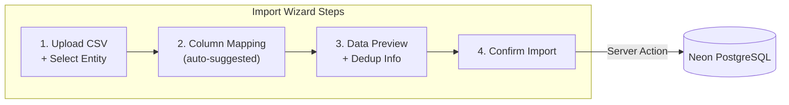
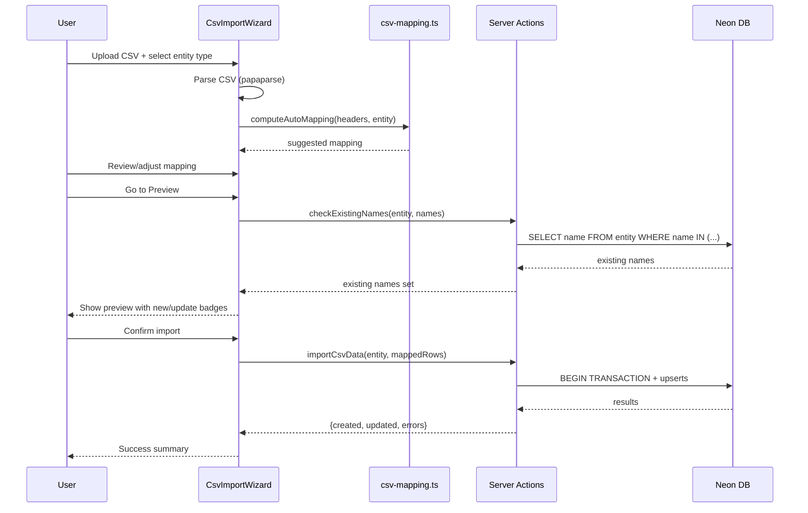

# CSV Import Admin Feature

## Architecture Overview




## New dependency

- `**papaparse**` (+ `@types/papaparse`) for robust CSV parsing with header detection, delimiter inference, and encoding handling.

## File changes

### 1. Navigation - Add Admin tab

`**[src/components/app-shell/AppHeader.tsx](src/components/app-shell/AppHeader.tsx)**`

Add `{ href: "/admin", label: "Admin" }` to the `navItems` array. Consistent with existing nav style.

### 2. Admin page (Server Component)

**New: `src/app/admin/page.tsx`**

Simple server component page matching the layout pattern of `/resources` and `/projects`. Renders a heading and the `<CsvImportWizard />` client component.

### 3. CSV Import Wizard (Client Component)

**New: `src/components/admin/CsvImportWizard.tsx`**

Top-level client component managing the multi-step wizard state:

- **Step indicator** at the top (numbered steps with active/completed states)
- **Step 1 - Upload**: Entity type selector (Resource / Project tabs) + file drop zone
- **Step 2 - Mapping**: Column mapping interface
- **Step 3 - Preview**: Data table with dedup indicators + confirm button

State managed via `useState`:

```typescript
type WizardState = {
  step: 1 | 2 | 3;
  entityType: "resource" | "project";
  csvHeaders: string[];
  csvRows: Record<string, string>[];
  mapping: Record<string, string | null>; // csvCol -> dbCol | null (skip)
  importResult: ImportResult | null;
};
```

### 4. Step 1 - Upload Component

**New: `src/components/admin/CsvUploadStep.tsx`**

- **Entity type selector**: Two tab-style buttons ("Resources" / "Projects") matching the visual pattern from `[PlanningGrid.tsx](src/components/planning/PlanningGrid.tsx)` (`role="tab"`, `aria-selected`).
- **File drop zone**: A styled drag-and-drop area with a fallback `<input type="file" accept=".csv,.tsv,.txt">` button. Styled with `--rm-surface`, `--rm-border` tokens, dashed border.
- On file select: parse with `papaparse` (client-side), extract headers + rows, pass up to wizard.
- Show error state for invalid files (no headers, empty, not parseable).

### 5. Step 2 - Column Mapping Component

**New: `src/components/admin/ColumnMappingStep.tsx`**

A table/grid showing:

- **Left column**: CSV column names (from the uploaded file)
- **Right column**: A `<select>` dropdown for each CSV column with options:
  - `(skip)` - don't import this column
  - Each DB field for the selected entity type

**DB fields per entity:**

- Resource: `name`, `role`, `team`, `capacity`, `status`, `createdAt`
- Project: `name`, `client`, `color`, `status`, `createdAt`

`status` maps to the `LifecycleStatus` enum (ACTIVE / ARCHIVED). The mapping logic should normalize common CSV values (e.g., "active"/"yes"/"1"/"true" -> ACTIVE, "archived"/"inactive"/"no"/"0"/"false" -> ARCHIVED). If not mapped or the value is unrecognized, default to ACTIVE.

**Auto-mapping** is applied on mount (from `[src/lib/csv-mapping.ts](src/lib/csv-mapping.ts)`) with visual indicators showing which mappings were auto-detected. The `name` column must be mapped (show validation error if not). Each DB field can only be mapped once (prevent duplicates in dropdowns).

**Visual**: A confidence badge next to auto-mapped fields (e.g., "exact match" in green, "suggested" in amber). Unmapped columns shown as skipped in muted text.

### 6. Intelligent Column Mapping Logic

**New: `src/lib/csv-mapping.ts`**

Pure function: `computeAutoMapping(csvHeaders: string[], entityType: "resource" | "project") => Record<string, string | null>`

Matching strategy (applied in order of priority):

1. **Exact match** (case-insensitive, trimmed): `"Name"` -> `name`, `"Role"` -> `role`
2. **Normalized match** (strip spaces, underscores, hyphens): `"team_name"` -> `team`, `"first name"` -> partial match
3. **Synonym map**: Predefined aliases per field:
  - `name`: `"full_name"`, `"resource_name"`, `"project_name"`, `"nom"`, `"label"`
  - `role`: `"position"`, `"title"`, `"job"`, `"job_title"`, `"function"`, `"poste"`
  - `team`: `"department"`, `"group"`, `"squad"`, `"equipe"`, `"unit"`, `"service"`
  - `capacity`: `"hours"`, `"weekly_hours"`, `"fte"`, `"disponibilite"`, `"capacite"`
  - `client`: `"customer"`, `"company"`, `"account"`, `"organization"`, `"societe"`
  - `color`: `"colour"`, `"hex"`, `"couleur"`
  - `status`: `"state"`, `"statut"`, `"active"`, `"lifecycle"`, `"archived"`, `"enabled"`
  - `createdAt`: `"created"`, `"created_at"`, `"creation_date"`, `"date_creation"`, `"date"`, `"created_on"`
4. **Substring containment**: If a CSV header contains a DB field name as substring (e.g., `"resource_role"` contains `"role"`)

Each match returns a confidence level: `"exact"` | `"high"` | `"medium"` used for the UI badge.

### 7. Step 3 - Data Preview Component

**New: `src/components/admin/ImportPreviewStep.tsx`**

- **Summary bar**: "X new records will be created, Y existing records will be updated, Z rows skipped"
- **Preview table**: Shows the mapped data in DB column format. Styled like the existing resource/project tables.
  - Rows are color-coded or badged: **New** (will be created) vs **Existing** (will be updated) vs **Duplicate** (skipped duplicate rows in CSV)
  - Deduplication check: calls a server action to compare `name` values against existing DB records
- **Action buttons**: "Back" (secondary) + "Import N records" (primary)
- Maximum 100 rows shown in preview with a note if truncated (data still fully imported)

### 8. Server Actions

**New: `src/app/admin/actions.ts`**

Two server actions following the existing pattern from `[actions.ts](src/app/resources/actions.ts)`:

`**checkExistingNames(entityType, names: string[])**`

- Queries DB for existing resources/projects matching the provided names
- Returns a `Set` of existing names for dedup display in preview

`**importCsvData(entityType, rows: MappedRow[])**`

- Validates each row with the appropriate Zod schema (`resourceSchema` / `projectSchema`) - relaxed for optional fields
- Uses Prisma `upsert` for each row:
  - Resource: `upsert` where `name` matches (note: Resource.name is not `@unique` in schema, so we need to query first then create/update)
  - Project: `upsert` where `name` matches (Project.name is `@unique`)
- For Resource (name is not unique): use `findFirst` by name, then `update` or `create`
- Wraps in a transaction for atomicity
- Returns `{ ok, created, updated, errors }`
- Calls `revalidatePath` for `/resources`, `/projects`, `/planning`

### 9. Schema consideration

Resource `name` is not `@unique` in the current Prisma schema (only indexed). For reliable deduplication, we should add `@unique` to `Resource.name`. This requires a migration. If duplicates already exist in the DB, this would fail -- but based on the stated requirement of using name for dedup, uniqueness is the correct constraint.

`**prisma/schema.prisma**`: Add `@unique` to `Resource.name` field, then run `prisma migrate dev`.

## UI/UX Design Tokens

All new components use the existing design system:

- Backgrounds: `--rm-bg`, `--rm-surface`, `--rm-surface-elevated`
- Borders: `--rm-border`, `--rm-border-subtle`
- Text: `--rm-fg`, `--rm-muted`, `--rm-muted-subtle`
- Accent: `--rm-primary` for active states, `--rm-warning` for suggested mappings
- Components: Reuse `Button` (primary/secondary/ghost variants), `Modal` if needed
- Layout: Same `max-w-[1800px]` centered container via `AppShell`

## Data Flow




