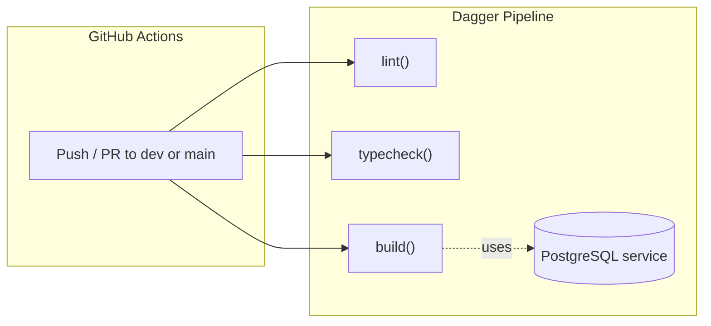

# Dagger CI Pipeline for Resource Master

## Why these checks

The project currently has **zero CI**. The goal is to catch the most impactful issues with the fewest moving parts:

- **Lint** -- already configured via ESLint with Next.js + TypeScript presets. Catches code quality regressions and framework anti-patterns.
- **Type check** -- TypeScript strict mode is on but there's no `typecheck` script. A `tsc --noEmit` step catches type errors that ESLint misses.
- **Build** -- `next build` is the ultimate integration check: it validates imports, server components, Prisma client generation, and page prerendering. Since `/projects` and `/resources` pages query the database at build time (static prerendering), the build needs a live PostgreSQL instance.

No test step is included because the project has no tests yet. When tests are added later, a `test()` function can be added to the Dagger module trivially.

## Architecture




**Lint** and **typecheck** run in parallel (no DB needed). **Build** runs `prisma generate` then `next build` against a PostgreSQL service container provided by Dagger.

## What gets added / changed

### 1. Add `typecheck` script to [package.json](package.json)

```json
"typecheck": "tsc --noEmit"
```

### 2. Create Dagger module (`dagger/`)

Initialize with `dagger init --sdk=typescript --name=ressource-master` which scaffolds:

- `dagger/dagger.json` -- module metadata
- `dagger/src/index.ts` -- pipeline code
- `dagger/package.json`, `dagger/tsconfig.json` -- SDK dependencies

The pipeline module (`dagger/src/index.ts`) exposes:

```typescript
@object()
class RessourceMaster {
  @func()
  async lint(source: Directory): Promise<string> { /* ... */ }

  @func()
  async typecheck(source: Directory): Promise<string> { /* ... */ }

  @func()
  async build(source: Directory): Promise<string> { /* ... */ }

  @func()
  async ci(source: Directory): Promise<string> { /* runs all three */ }
}
```

Key implementation details:

- Base container: `node:22-slim` with npm ci for dependency installation
- `lint()`: runs `npm run lint`
- `typecheck()`: runs `npm run typecheck`
- `build()`: starts a `postgres:16-alpine` Dagger service, sets `DATABASE_URL`, runs `npx prisma generate` then `npm run build`
- `ci()`: calls lint, typecheck, and build concurrently, collects results

### 3. Create GitHub Actions workflow (`.github/workflows/ci.yml`)

```yaml
name: CI
on:
  push:
    branches: [dev, main]
  pull_request:
    branches: [dev, main]

jobs:
  ci:
    runs-on: ubuntu-latest
    steps:
      - uses: actions/checkout@v4
      - uses: dagger/dagger-for-github@v7
        with:
          verb: call
          args: ci --source=.
```

That's it -- the entire CI config is ~15 lines. All logic lives in the Dagger module, which is testable locally with `dagger call ci --source=.`.

## What is NOT included (intentionally)

- **Tests** -- none exist yet; trivial to add a `test()` function later
- **Prisma migrations** -- CI validates the schema and build, not migration state
- **Deploy** -- out of scope; CI is about validation
- **Dagger Cloud** -- optional optimization, not needed to start
- **Docker image build** -- no Dockerfile exists; not needed now

