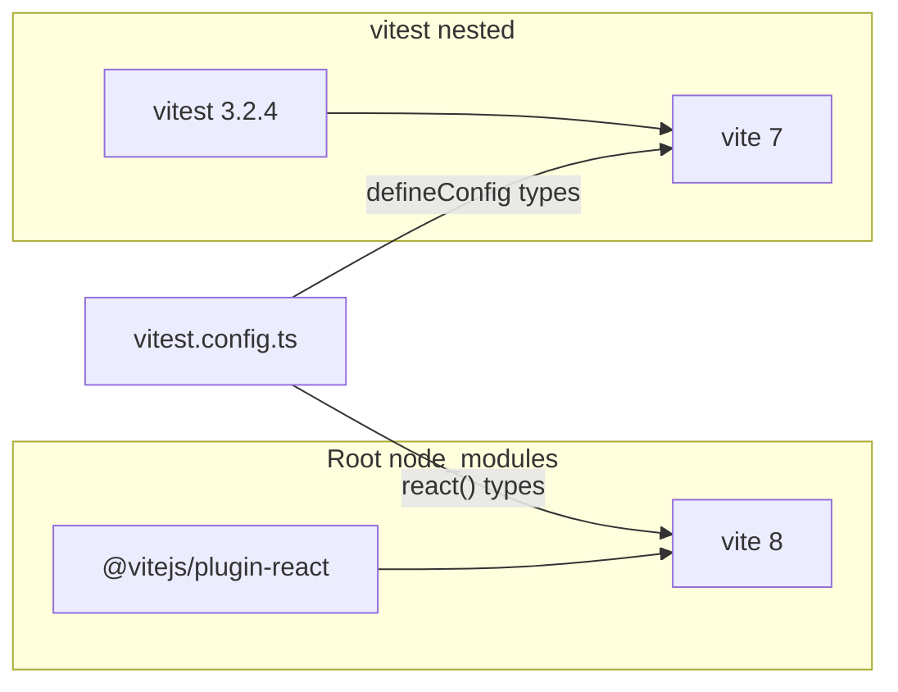

# Fix `next build` failing on `vitest.config.ts` (dual Vite types)

## What is going wrong

- [`@vitejs/plugin-react` 6.0.1](package-lock.json) declares **`vite: ^8.0.0`** as a peer, so npm hoists **Vite 8.0.8** to `node_modules/vite` (uses **rolldown** in its types).
- **Vitest 3.2.4** lists **`vite: ^5 || ^6 || ^7`** only, so npm installs **Vite 7.3.2** at `node_modules/vitest/node_modules/vite` (rollup-based types).
- In [`vitest.config.ts`](vitest.config.ts), `defineConfig` from `vitest/config` expects plugins typed against Vitest’s Vite, but `react()` returns plugins typed against the root Vite 8 — hence the long error at line 21 (`plugins: [react()]`).
- [`tsconfig.json`](tsconfig.json) includes **`**/*.ts`**, so **`vitest.config.ts` is typechecked as part of `next build`**, even though it is not application code.

## Recommended fix: one Vite tree (upgrade Vitest)

**Bump `vitest` to 4.x** (current line on npm shows `vite` as **`^6.0.0 || ^7.0.0 || ^8.0.0`** for Vitest 4.1.x), so npm can satisfy both Vitest and `@vitejs/plugin-react` with **the same hoisted Vite 8** and remove `vitest/node_modules/vite` (or stop using it for types).

Concrete steps after you leave plan mode:

1. In [`package.json`](package.json), set `vitest` to a 4.x range (e.g. `^4.1.4` or whatever you prefer after checking the [Vitest migration guide](https://vitest.dev/guide/migration)).
2. Run `npm install` and confirm the lockfile: ideally **only** `node_modules/vite` (no duplicate under `vitest/node_modules/vite`), or at least that Vitest resolves the hoisted Vite 8.
3. Run **`npm run build`** and **`npm test`**; adjust [`vitest.config.ts`](vitest.config.ts) only if Vitest 4 reports deprecated or changed options (e.g. `test.projects` / pool defaults — follow migration notes for anything that breaks).

**Optional hardening:** add an explicit devDependency `"vite": "^8.0.8"` (pin compatible with plugin-react) so the toolchain always has a declared Vite version; often unnecessary once Vitest 4 is in place.

## Low-effort workaround (if you cannot upgrade Vitest yet)

Add **`vitest.config.ts`** to **`exclude`** in [`tsconfig.json`](tsconfig.json) so `next build` no longer typechecks that file.

- **Pros:** Minimal diff; unblocks `next build` immediately.
- **Cons:** Does not remove the **runtime** duplicate Vite install; you still have two Vites until dependencies are aligned. IDE may follow the same `tsconfig` and show weaker checking on that file unless you add a small `tsconfig.vitest.json` that only includes the config (optional).

## Alternative: stay on Vitest 3

Downgrade **`@vitejs/plugin-react`** to a **5.x** release whose peer range includes **Vite 7**, and add an explicit **`vite` ^7** devDependency so Vitest 3 and the React plugin share one Vite major. This is more moving parts than upgrading Vitest and trades away Vite 8 / plugin-react 6.

## Verification

- `npm run build` completes without TypeScript errors.
- `npm test` still passes for both projects in [`vitest.config.ts`](vitest.config.ts) (node + jsdom).

## Documentation

No user-facing docs in this repo appear to pin a Vitest version; a Vitest 4 upgrade is internal tooling. If [`docs/SETUP.md`](docs/SETUP.md) or [`README.md`](README.md) ever mention a specific Vitest major, update that line when implementing.
