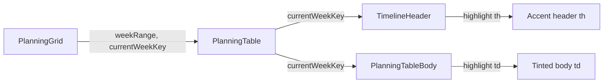

# Highlight Current Week in Planning View

## Approach

The current week is identified by comparing each `weekRange` date against `getIsoMonday(new Date())`. A new utility `isCurrentWeek(d)` in [`src/lib/weeks.ts`](src/lib/weeks.ts) encapsulates this logic (easily testable in node). The computed `currentWeekKey` (`YYYY-MM-DD` string) is passed as a prop through the component tree, and conditional Tailwind classes apply the highlight in the header and body cells.

## Data Flow

## Files Changed

- [`src/lib/weeks.ts`](src/lib/weeks.ts) — add `isCurrentWeek(d: Date): boolean` and `getCurrentWeekKey(): string`
- `src/lib/weeks.test.ts` _(new)_ — Vitest tests for both new helpers
- [`src/components/planning/planningStickyClasses.ts`](src/components/planning/planningStickyClasses.ts) — add `weekHeadCellCurrent` and `weekBodyCellCurrent` class strings
- [`src/components/planning/TimelineHeader.tsx`](src/components/planning/TimelineHeader.tsx) — accept `currentWeekKey?: string`, apply accent class when week matches
- [`src/components/planning/PlanningTableBody.tsx`](src/components/planning/PlanningTableBody.tsx) — accept `currentWeekKey?: string`, apply tint class to all cells in the current week column
- [`src/components/planning/PlanningTable.tsx`](src/components/planning/PlanningTable.tsx) — compute `currentWeekKey` via `toWeekStartKey(getIsoMonday(new Date()))`, pass it down to both header and body

## Visual Style

- **Header `<th>`**: top accent border (e.g. `border-t-2 border-t-[var(--rm-accent)]` or equivalent blue) + slightly elevated background + label kept as-is
- **Body `<td>`**: subtle tint overlay (e.g. `bg-blue-50/5` dark-mode-safe) layered on existing `weekBodyCell` and `weekHeadCell` classes

> Exact class values will follow the existing `var(--rm-...)` CSS variable conventions discovered during implementation.

## Test Scope

Since Vitest runs in `environment: "node"` with `.test.ts` only, tests cover the pure logic layer:

- `isCurrentWeek` returns `true` for today's Monday, `false` for other weeks
- `getCurrentWeekKey` returns a valid `YYYY-MM-DD` string matching today's Monday
- Edge cases: end-of-week day (Sunday), first/last day of year, `vi.setSystemTime` for deterministic dates
