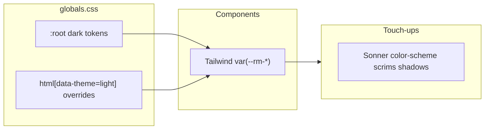

# Light mode for Resource Planner

## Current state

- **Single theme in CSS**: [`:root`](src/app/globals.css) holds all `--rm-*` tokens, `color-scheme: dark`, and Tailwind v4 `@theme inline` maps `--color-background` / `--color-foreground` to those tokens.
- **Components follow tokens**: Shell, tables, planning grid ([planningStickyClasses.ts](src/components/planning/planningStickyClasses.ts)), forms, modals, etc. use `bg-[var(--rm-surface)]`, `text-[var(--rm-fg)]`, etc. That is the right abstraction for dual themes without rewriting every screen.
- **Product intent**: [docs/ui-system.md](docs/ui-system.md) describes a dark-first internal tool; light mode is a product/design decision (contrast, scrim strength, whether the brand mark treatment stays the same — [AppBrandIcon](src/components/app-shell/AppBrandIcon.tsx) already tints via `currentColor`, so it should adapt if header text colors are tuned for light).

## What you need to build

### 0. Test-driven implementation (mandatory)

Follow **[`.cursor/skills/tdd/SKILL.md`](.cursor/skills/tdd/SKILL.md)** for the whole delivery, not ad-hoc coding:

- **Red**: Add Vitest + Testing Library tests *before* production behavior exists (project already uses Vitest — see `package.json`). Target **testable contracts**: e.g. reading/writing the stored preference, applying `data-theme` on `document.documentElement`, toggle click switching theme and updating `aria-label` / icon role, edge cases (missing key, invalid value).
- **Review**: Present failing tests for approval per the skill (including model choice for tests vs implementation if the skill’s Phase 0 question applies).
- **Green / refactor**: Implement minimal code to pass; keep theme side effects testable by extracting small pure helpers or a thin module where helpful.
- **Pure CSS** (token values in `globals.css`, scrim tokens): not every line needs a unit test; rely on the skill’s spirit — test what encodes **behavior and regressions**; use manual visual QA for palette polish.
- **Close**: Run **documentation-sync** (`.cursor/skills/documentation-sync/SKILL.md`) after user-visible behavior changes, as the TDD skill’s final phase expects.

### 1. Light palette (design + CSS)

- Duplicate the semantic token set for a **light** context: surfaces (page, raised panels), borders, foreground/muted text, primary (indigo can stay; adjust `--rm-primary-text` / hover for contrast on light backgrounds), danger/warning if needed.
- Implement as **overrides** on a selector that wraps the app, e.g. `html[data-theme="light"]` (keep existing `:root` as dark default, or invert: default light + dark override — either works).
- Update `color-scheme` to match the active theme (`light` vs `dark`) on the same element so native controls, scrollbars, and date/time inputs behave correctly.

### 2. Theme switching mechanics

- **User choice**: A **single control** in the app shell (recommended: [AppHeader.tsx](src/components/app-shell/AppHeader.tsx), immediately before [HelpButton](src/components/app-shell/HelpDialog.tsx)) so it is always available.
- **Icon-only UI (your spec)**:
  - **Dark mode active** → show a **sun** icon (affordance: “switch to light”).
  - **Light mode active** → show a **moon** icon (affordance: “switch to dark”).
  - **No text label** on the button; rely on **clear `aria-label`** strings that swap with the mode (e.g. “Switch to light mode” / “Switch to dark mode”) so screen readers are not left guessing.
  - **Implementation detail**: The repo has no shared icon package ([HelpDialog](src/components/app-shell/HelpDialog.tsx) uses inline SVG); match that pattern with small sun/moon paths (or add a dependency only if you explicitly want one — default plan stays dependency-free).
- **Behavior**: Clicking toggles `data-theme` on `document.documentElement` and persists preference (**localStorage**). Style the control like other header chrome: muted default, hover to foreground, `focus-visible` ring consistent with nav links.
- **Optional system default**: `prefers-color-scheme` as initial value when no stored preference exists (small script or `next-themes`-style hydration to limit flash of wrong theme on first paint).
- **Next.js note**: Root layout is a server component ([layout.tsx](src/app/layout.tsx)); the toggle must be a **client component** that only runs after mount (or use a tiny inline blocking script if you want zero flash — optional complexity).

### 3. Fix dark-only literals (small but necessary)

These will look wrong or behave wrong in light mode until addressed:

| Area | Files | Issue |
|------|--------|--------|
| Native inputs | [Input.tsx](src/components/ui/Input.tsx) | `[color-scheme:dark]` forces dark chrome |
| Toasts | [layout.tsx](src/app/layout.tsx) | `<Toaster theme="dark" />` should follow theme |
| Scrims | [Modal.tsx](src/components/ui/Modal.tsx), [SidePanel.tsx](src/components/ui/SidePanel.tsx), [HelpDialog.tsx](src/components/app-shell/HelpDialog.tsx) | `bg-black/55` and `bg-black/60` — use a token (e.g. `--rm-scrim`) or softer opacity in light |
| Elevation | Modal, HelpDialog, [Select.tsx](src/components/ui/Select.tsx) | `shadow-[0_4px_24px_rgba(0,0,0,...)]` — optional `--rm-shadow-elevated` for lighter shadows on light surfaces |
| Primary buttons | [Button.tsx](src/components/ui/Button.tsx), [PlanningTable.tsx](src/components/planning/PlanningTable.tsx), [CsvImportWizard.tsx](src/components/admin/CsvImportWizard.tsx) | `text-white` on indigo is usually fine; verify WCAG contrast on the chosen light primary |

No broad grep-driven rewrite of every `tsx` file is required if new tokens cover scrim/shadow.

### 4. Docs and help (if you ship the feature)

- Update [docs/ui-system.md](docs/ui-system.md) to mention supported themes and that the **sun/moon control** in the header switches appearance (no separate label).
- If Help copy references “dark” as the only experience, align [HelpDialog.tsx](src/components/app-shell/HelpDialog.tsx) and run the repo’s documentation impact workflow for user-visible behavior.

## Effort and risk

- **Effort**: **Medium** — mostly one CSS file + **one small client `ThemeToggle`** (sun/moon) mounted in the header + ~5–8 targeted component/layout tweaks, then visual QA on Planning (sticky headers, selection highlights), modals, CSV wizard, and admin tables.
- **Risk**: **Visual polish** (grid zebra/stripes, border opacity `/40` tokens, focus rings) and **hydration flash** if you skip a blocking theme script; **accessibility** (contrast on muted text and primary tints on light surfaces).

