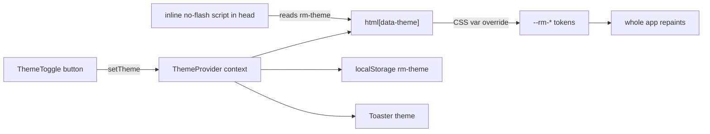

# Light mode (Dark / Light theme toggle)

## What "light mode" means here
The app is a "dark-first design system": every color is a `--rm-*` CSS variable defined in `:root` in [src/app/globals.css](src/app/globals.css) with `color-scheme: dark`, and components reference those tokens (there are zero hardcoded palette colors like `bg-gray-500`). "Light mode" = a second set of token values plus a way to switch and remember the choice. Per your answers: a single **Dark <-> Light** toggle, **Dark is the default** on first visit.

## Why this is efficient
Because all UI reads from `--rm-*`, switching themes is just **overriding those variables on `<html>`** — one repaint, no component re-render, no per-component edits. This is the cleanest possible theming surface.



## Implementation

### 1. Light token set — [src/app/globals.css](src/app/globals.css)
Keep the current `:root` (dark) as-is. Add a light override block that flips `color-scheme` and redefines the `--rm-*` palette (light backgrounds, dark text, same indigo accent semantics):

```css
:root[data-theme="light"] {
  color-scheme: light;
  --rm-bg: #f7f7f8;
  --rm-surface: #ffffff;
  --rm-surface-elevated: #f1f1f3;
  --rm-surface-highest: #e8e8ec;
  --rm-border: #d8d8dd;
  --rm-border-subtle: #e4e4e8;
  --rm-fg: #1c1c20;
  --rm-muted: #5a5a61;
  --rm-muted-subtle: #8a8a91;
  --rm-primary: #6366f1;
  --rm-primary-hover: #4f46e5;
  --rm-primary-text: #4338ca;
  --rm-danger: #dc2626;
  --rm-danger-hover: #b91c1c;
  --rm-warning: #d97706;
}
```
(Exact hexes tuned during implementation for contrast/AA.)

### 2. Theme module — `src/lib/theme.ts` (new)
- `type Theme = "dark" | "light"`, `STORAGE_KEY = "rm-theme"`, `DEFAULT: Theme = "dark"`.
- `getStoredTheme()` reads localStorage and **validates against the allowlist** (only `"light"`/`"dark"` accepted; anything else -> default). This is the security boundary: a tampered storage value can never become an arbitrary attribute/string.
- `applyTheme(t)` sets/removes `document.documentElement.dataset.theme`.

### 3. No-flash init + dynamic toast — [src/app/layout.tsx](src/app/layout.tsx)
- Add `suppressHydrationWarning` to `<html>`.
- Inject a **static, blocking inline script** in `<head>` that reads `localStorage["rm-theme"]`, and if it equals `"light"` sets `document.documentElement.dataset.theme = "light"` before first paint (default dark needs no attribute). The string is a fixed literal with no interpolated/user data, so it is not an XSS vector.
- Move `<Toaster>` into the client tree (AppShell) so its `theme` prop tracks the active theme instead of the hardcoded `theme="dark"`.

### 4. Theme context + toggle
- `src/components/app-shell/ThemeProvider.tsx` (new, client): holds `theme` state seeded from the `<html data-theme>` attribute (set by the init script), exposes `useTheme()` with `toggle()`; on change calls `applyTheme` + writes localStorage.
- Wrap content in [src/components/app-shell/AppShell.tsx](src/components/app-shell/AppShell.tsx) with `ThemeProvider` and render `<Toaster theme={theme}>` there.
- `src/components/app-shell/ThemeToggle.tsx` (new): icon button (sun/moon) added to [src/components/app-shell/AppHeader.tsx](src/components/app-shell/AppHeader.tsx) next to `HelpButton`, with `aria-label`/`aria-pressed`, matching existing header control styling.

### 5. Fix the two dark-hardcoded spots — [src/components/ui/Select.tsx](src/components/ui/Select.tsx)
The portaled menu hardcodes `colorScheme: "dark"` and dark hex fallbacks (lines ~259-262). Change `colorScheme` to inherit the document scheme and use theme-neutral fallbacks so the dropdown follows the active theme. The `rgba(0,0,0,0.25)` shadows in Select/Modal/HelpDialog are acceptable in both themes (soft shadow) and can stay.

## Testing (TDD — mandatory per repo skill)
Per [.cursor/skills/tdd/SKILL.md](.cursor/skills/tdd/SKILL.md), write failing tests first, get your review of the red suite, then implement. Vitest infra exists (`vitest.config.ts`). Tests to cover:
- `theme.ts`: `getStoredTheme()` returns default for missing/garbage values, honors valid stored value; `applyTheme` sets/clears the attribute.
- `ThemeToggle`/`ThemeProvider`: renders correct state from initial attribute, click flips `data-theme` and writes localStorage, `aria` reflects state.

## Documentation (documentation-sync — mandatory)
Per [.cursor/skills/documentation-sync/SKILL.md](.cursor/skills/documentation-sync/SKILL.md): update [README.md](README.md) (it currently says "minimalist dark UI"), [docs/ui-system.md](docs/ui-system.md) (dark-first + light tokens), in-app help [src/components/app-shell/HelpDialog.tsx](src/components/app-shell/HelpDialog.tsx) and [CHEATSHEET.md](CHEATSHEET.md) (mention the toggle), append a newest-first [docs/DEV_LOG.md](docs/DEV_LOG.md) entry, and propose a `feat` MINOR bump to [package.json](package.json) + [src/lib/app-version.ts](src/lib/app-version.ts) (await your confirmation before editing versions).

## Security / efficiency summary
- **No XSS surface**: inline init script is a fixed literal; stored value is allowlist-validated before use.
- **No new deps, no network, no DB, no auth impact** — purely client-side presentation state in localStorage.
- **No flash**: blocking pre-paint script; **cheap switching**: CSS-variable override, no re-render.

## Out of scope
System (`prefers-color-scheme`) auto-follow and a 3-way picker (you chose simple 2-state); per-user server persistence (no auth/user table exists).