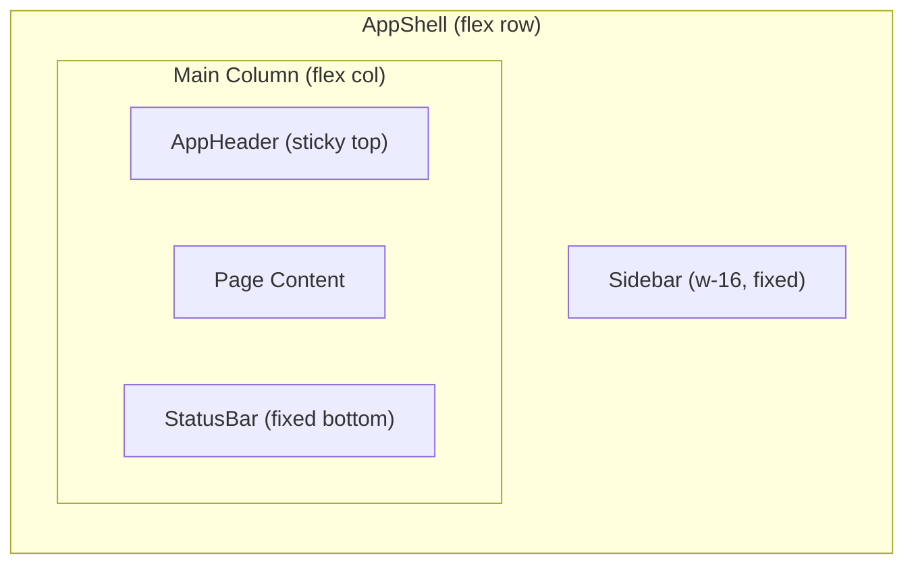

# UI Redesign: Indigo Graphite Integration

## Current State

The app uses a simple vertical layout: sticky `AppHeader` with horizontal nav (Planning, Projects, Resources, Admin) and a centered content area. Styling uses Tailwind v4 CSS-based configuration with `--rm-*` custom properties in [globals.css](src/app/globals.css). Layout is managed by [AppShell.tsx](src/components/app-shell/AppShell.tsx) wrapping [AppHeader.tsx](src/components/app-shell/AppHeader.tsx). The planning grid is built with a `<table>` using sticky columns ([planningStickyClasses.ts](src/components/planning/planningStickyClasses.ts)).

## Architecture After Changes




The sidebar sits on the left (icon-only, 64px). The main column holds the header, page content, and a slim bottom bar. No layout logic is duplicated -- `AppShell` remains the single layout owner.

---

## 1. Update Design Tokens

**File:** [src/app/globals.css](src/app/globals.css)

Align CSS variables with the Indigo Graphite palette from the reference. Key changes:

- `--rm-bg: #0e0e10` (was `#0d0d0f` -- slightly warmer)
- `--rm-surface: #19191c` (was `#161618`)
- `--rm-surface-elevated: #1f1f23` (was `#1c1c1f`)
- `--rm-border: #2a2a2e` stays, add `--rm-border-subtle: #222226` (already exists)
- `--rm-fg: #e7e4ea` (was `#fafafa` -- softer white, better readability)
- `--rm-muted: #acaaaf` (was `#a1a1a6`)
- `--rm-primary: #6366f1` stays (matches reference `primary-dim`)
- Add `--rm-primary-text: #c0c1ff` for primary-colored text (matches reference headers)
- Add `--rm-surface-highest: #252529` for elevated containers

No font change needed -- Geist/Geist Mono are already clean sans/mono fonts aligned with the Linear aesthetic. Switching to Inter/JetBrains Mono would be a lateral move with migration cost.

---

## 2. Create Sidebar Component

**New file:** `src/components/app-shell/AppSidebar.tsx`

A compact 64px icon sidebar pinned to the left, containing:

- **Admin** (functional, links to `/admin`) -- removed from header
- **Settings** (greyed out, non-functional, with `cursor-not-allowed` + `opacity-50`)

Uses Material Symbols Outlined icons (add via `next/head` or a `<link>` in root layout). Icons: `admin_panel_settings` for Admin, `settings` for Settings.

The sidebar will use the same `--rm-`* tokens. Active state: `bg-[var(--rm-surface-elevated)]` + `text-[var(--rm-primary-text)]`. Inactive: `text-[var(--rm-muted)]`.

```tsx
// Sketch of the component structure
export function AppSidebar() {
  const pathname = usePathname();
  return (
    <aside className="fixed left-0 top-0 z-40 flex h-dvh w-16 flex-col border-r border-[var(--rm-border-subtle)] bg-[var(--rm-bg)] py-4">
      {/* Top: functional nav items */}
      <nav className="flex flex-col items-center gap-2">
        <SidebarItem href="/admin" icon="shield_person" label="Admin" active={pathname?.startsWith("/admin")} />
      </nav>
      {/* Bottom: settings (greyed out) */}
      <div className="mt-auto flex flex-col items-center">
        <SidebarItem disabled icon="settings" label="Settings" />
      </div>
    </aside>
  );
}
```

---

## 3. Restyle AppHeader

**File:** [src/components/app-shell/AppHeader.tsx](src/components/app-shell/AppHeader.tsx)

Changes:

- Remove "Admin" from `navItems` array (moved to sidebar)
- Brand name: keep "Resource Master" but style with `text-[var(--rm-primary-text)]` and `tracking-tighter font-bold`
- Active link indicator: use `border-[var(--rm-primary-text)]` underline instead of `border-[var(--rm-fg)]`
- Adjust left padding to account for sidebar width (`ml-16`)
- Keep `HelpButton` in the right side
- Background: `bg-[var(--rm-bg)]` (opaque, no blur -- matches reference "flat no shadows")
- Border bottom: `border-[var(--rm-border-subtle)]/20` (more subtle)

---

## 4. Restructure AppShell Layout

**File:** [src/components/app-shell/AppShell.tsx](src/components/app-shell/AppShell.tsx)

```tsx
export function AppShell({ children }: { children: React.ReactNode }) {
  return (
    <div className="flex min-h-dvh bg-[var(--rm-bg)] text-[var(--rm-fg)]">
      <AppSidebar />
      <div className="ml-16 flex min-h-dvh flex-1 flex-col">
        <AppHeader />
        <div className="mx-auto w-full max-w-[1800px] flex-1 px-4 py-6 sm:px-5">
          <main className="min-w-0 pb-10">{children}</main>
        </div>
        <StatusBar />
      </div>
    </div>
  );
}
```

Bottom padding on main (`pb-10`) accommodates the fixed status bar.

---

## 5. Refine Planning Table Cell States

**Files:** [EditableAllocationCell.tsx](src/components/planning/EditableAllocationCell.tsx), [planningStickyClasses.ts](src/components/planning/planningStickyClasses.ts), [TotalPctPill.tsx](src/components/planning/TotalPctPill.tsx)

Align cell visual states with the interaction guide from the reference:

- **Empty cell (hover):** Show `+` in `text-[var(--rm-muted-subtle)]/30` -- already implemented, just adjust opacity
- **Filled cell (default):** Use `font-mono` for percentage values, `text-[var(--rm-muted)]` for < 100%, `text-[var(--rm-primary-text)]` for = 100%
- **Selected (editing):** `border-2 border-[var(--rm-primary-text)]` + `bg-[var(--rm-surface-highest)]`
- **Overload (> 100%):** `text-[var(--rm-danger)]` + subtle `border border-[var(--rm-danger)]`
- **Note indicator:** Top-right corner triangle using CSS border trick (`border-t-[var(--rm-primary)]` 8px) instead of current dot -- matches reference's corner fold

Update `weekBodyCell` in `planningStickyClasses.ts`:

- Use `border-l border-[var(--rm-border-subtle)]/10` between week columns for subtle grid lines

Update sticky column backgrounds to use `--rm-surface` (aligns with reference's row backgrounds).

---

## 6. Add Minimal Bottom Status Bar

**New file:** `src/components/app-shell/StatusBar.tsx`

A slim (32px) fixed-bottom bar showing real data. Content:

- **Resource count:** fetched via a lightweight server component or passed from layout
- **Project count:** same
- **Active bookings count:** same

Since this data is available from Prisma and the bar is in the shell, we have two options:

- (A) Make `AppShell` a server component wrapper that fetches counts and passes to a client `StatusBarClient`
- (B) Use a separate `StatusBarData` server component that streams the data

Option A is simpler -- add a `StatusBarWrapper` server component in the layout that queries counts and passes them as props.

```tsx
// StatusBar.tsx (client component)
export function StatusBar({ resourceCount, projectCount }: StatusBarProps) {
  return (
    <footer className="fixed bottom-0 left-16 right-0 z-50 flex h-8 items-center border-t border-[var(--rm-border-subtle)]/20 bg-[var(--rm-bg)] px-4 font-mono text-[10px] uppercase tracking-widest text-[var(--rm-muted)]">
      <span>{resourceCount} resources</span>
      <span className="mx-4">·</span>
      <span>{projectCount} projects</span>
    </footer>
  );
}
```

---

## 7. Add Material Symbols Font

**File:** [src/app/layout.tsx](src/app/layout.tsx)

Add the Material Symbols Outlined font for sidebar icons. A single `<link>` in the `<head>`:

```html
<link href="https://fonts.googleapis.com/css2?family=Material+Symbols+Outlined:wght,FILL@400,0" rel="stylesheet" />
```

Add a minimal CSS rule in `globals.css` for the `.material-symbols-outlined` class.

---

## Files Changed Summary


| File                                                 | Change Type                                           |
| ---------------------------------------------------- | ----------------------------------------------------- |
| `src/app/globals.css`                                | Edit (update tokens, add icon font styles)            |
| `src/app/layout.tsx`                                 | Edit (add font link, restructure for status bar data) |
| `src/components/app-shell/AppShell.tsx`              | Edit (add sidebar + status bar, flex layout)          |
| `src/components/app-shell/AppHeader.tsx`             | Edit (restyle, remove Admin link)                     |
| `src/components/app-shell/AppSidebar.tsx`            | **New** (compact icon sidebar)                        |
| `src/components/app-shell/StatusBar.tsx`             | **New** (minimal bottom bar)                          |
| `src/components/planning/EditableAllocationCell.tsx` | Edit (cell state styling)                             |
| `src/components/planning/planningStickyClasses.ts`   | Edit (grid line styling, token alignment)             |
| `src/components/planning/TotalPctPill.tsx`           | Edit (token alignment)                                |


